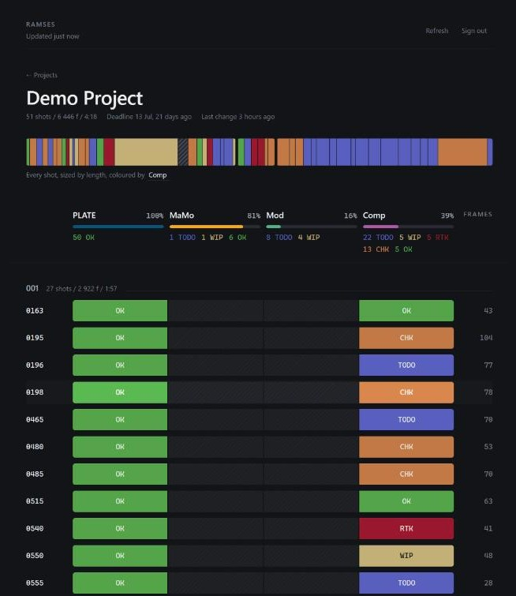
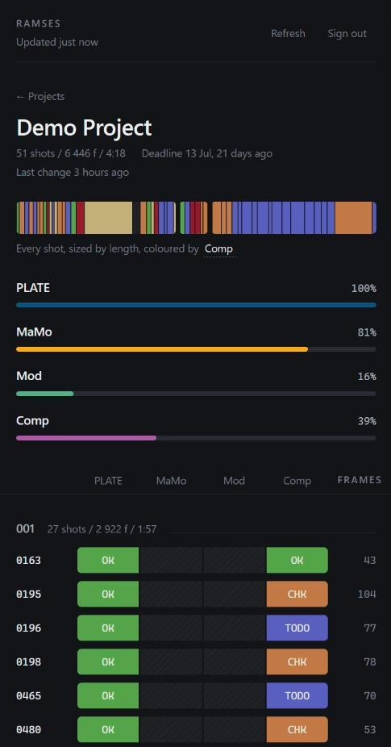

# Ramses-Web

A phone and tablet view of where every shot in your Ramses projects stands.

Sign in with your normal Ramses account and you get the same picture the desktop
client shows: completion per project, per step and per shot, coloured by state.
It is a window into Ramses, not a replacement for Ramses-Client.

Read-only today. Setting a shot step's state from the phone is planned and not
built yet.

Every shot is a lane, segmented by pipeline step and coloured by its state. The
ribbon at the top is the whole project: one block per shot, sized by its length
in frames, so you can see where the work sits rather than only how much is left.
It is coloured by the last step in your pipeline, and you can pick a different
one.

## Requirements

- **Ramses-Server 1.0.0-RC12 or newer**, served over **HTTPS**, that you can
  upload files to. That release is where the endpoints this app calls live. On
  an older server, use the `standalone-php` tag of this repo, which ships them
  separately.
- An SFTP client
- Windows, for the build scripts (PowerShell)
- Python 3, to run the local preview
- Node 20 or newer, to run the tests

Node and Python are only needed to work on the app. Neither is required on the
server.

## Try it locally

No server needed. This runs the whole app against a sample project:

    python tools\mockserver.py 8099

Then open <http://127.0.0.1:8099/ramses/app/> and sign in with anything.

## Deploy

Ramses-Server ships this app from 1.0.0-RC12 on, so a normal server install
already has it at `/ramses/app/`. Deploying by hand is for updating the app
without rebuilding the server.

**1. Build and stage the release.**

    tools\fetch-tools.ps1     # first time only, downloads the Tailwind CLI
    tools\build.ps1
    tools\publish.ps1

This creates `publish\ramses\`, laid out exactly like the server.

**2. Upload the contents of `publish\ramses\`** into your Ramses-Server folder,
the one containing `index.php`. You are replacing one folder:

    app\             ->  the app/ subfolder

Check that `app\.htaccess` uploaded. Some SFTP clients hide dotfiles, and the
app needs it to serve its stylesheet and scripts.

**3. Open `https://your-server/ramses/app/`** and sign in.

Ramses-Server's own `tools\deploy.py` copies this repo's `app\` into the server
package, so a full server deployment carries the app with it and these steps
are not needed.

### If something is wrong

| What you see | What it means |
| --- | --- |
| "The server answered with a web page instead of JSON" | `app/` is not one level below the API folder. The message shows the URL it tried. |
| Unstyled page, no colours | `app/.htaccess` is missing, or the stylesheet returned 403 or 404. |
| Changes do not appear after uploading | Cached. Hard-reload before looking for anything else. |
| "Either this project doesn't exist..." | You are signed in but not assigned to that project in Ramses. |

## Layout

    app/         The only folder that goes on the server
    src/         Tailwind source for the stylesheet
    tools/       Build, preview and release scripts
    tests/       Test suite and sample project data
    docs/        SPEC.md (what it does), DEPLOY.md (deployment detail)

`app/` contains only what ships. Keep tests, scripts and documentation out of it.

## How it is built

- **Tailwind CSS**, through the standalone CLI. No npm and no `node_modules`.
  `app/assets/app.css` is committed, so the server never builds anything.
- **Alpine.js**, vendored at a pinned version.
- Plain `fetch` and ES modules. No framework, no bundler.

Do not add npm dependencies. Deploying is meant to stay a folder copy.

## Working on it

    tools\watch.ps1                  rebuild the stylesheet on change, serve app/ on :8080
    python tools\mockserver.py 8099  the full app against the sample project
    node --test                      run the tests
    tools\publish.ps1                stage a release

Use the preview before uploading. Every screen, including sign-in, works against
the sample data.

### The completion percentages

They must match what Ramses-Client shows. The formula lives in
`app/js/format.js`, which documents the client code it mirrors, and the tests
pin it against figures taken from a real project and checked against the
desktop.

That project's database is committed, anonymised, as
`tests/fixtures/demo.ramses`. To refresh it from your own data, see
`tests/anonymise_fixture.py`.

### Tests

    node --test

`package.json` exists so the test runner reads `app/js/*.js` as ES modules. It
has no dependencies.
